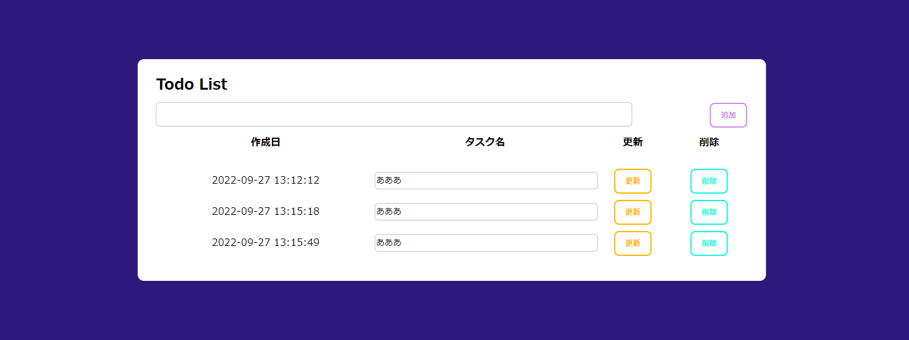
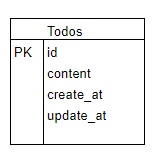

# アプリケーション名
Todo管理アプリ

  

## 作成した目的
日々の仕事の記録

## 機能一覧
・Todo一覧表示

・Todo作成

・Todo更新

・Todo削除

## 使用技術（実行環境）
Laravel　8.83.24

## テーブル設計

テーブル名：
Todos

カラム：
id
content
create_at
update_at
	

## ER図

  

## 他に記載することがあれば記述する
